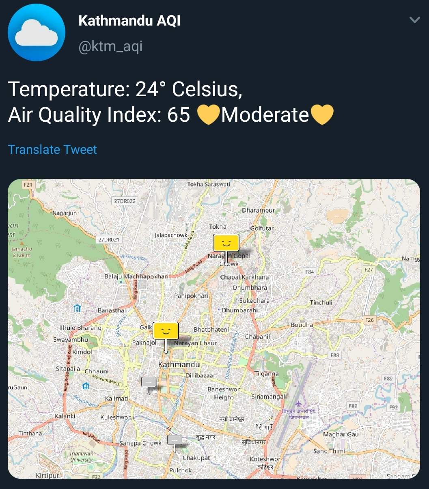

# Kathmandu Air Quality Index Twitter Bot

A Twitter bot for Air Quality of Kathmandu Valley. Powered by [Air Visual](https://www.iqair.com/air-pollution-data-api)

[Kathmandu AQI bot](https://twitter.com/ktm_aqi) tweets  the Air Quality Index along with Current Temperature of Kathmandu Valley. It tweets at a six-hour interval. If there is any change either in the API or hosting platform, it will tweet outside of the scheduled times.
The Twitter Bots that I have created.
  
# Screenshot
 
 
  
  
# Tools Used
 - [Node.js](https://nodejs.org/en/)
 - [Express](https://expressjs.com/)
 - [Heroku](https://www.heroku.com/)
 - [Twit](https://github.com/ttezel/twit)
 - [Air Visual API](https://airvisual.com/api/documentation)
 - [Twitter API](https://developer.twitter.com/en/docs)
  
  
 If you have any feedback, ideas or want to collobrate on any project then tweet me [@ApexAbim](https://twitter.com/ApexAbim)
